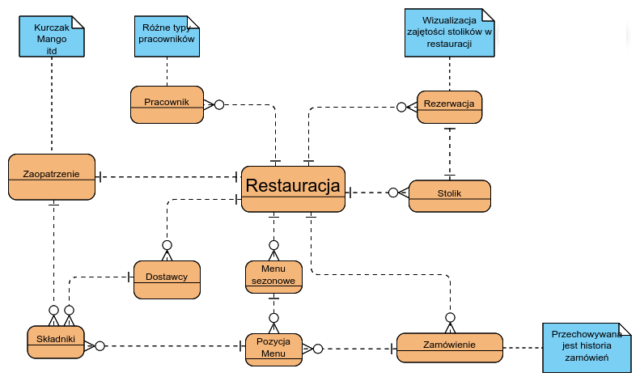
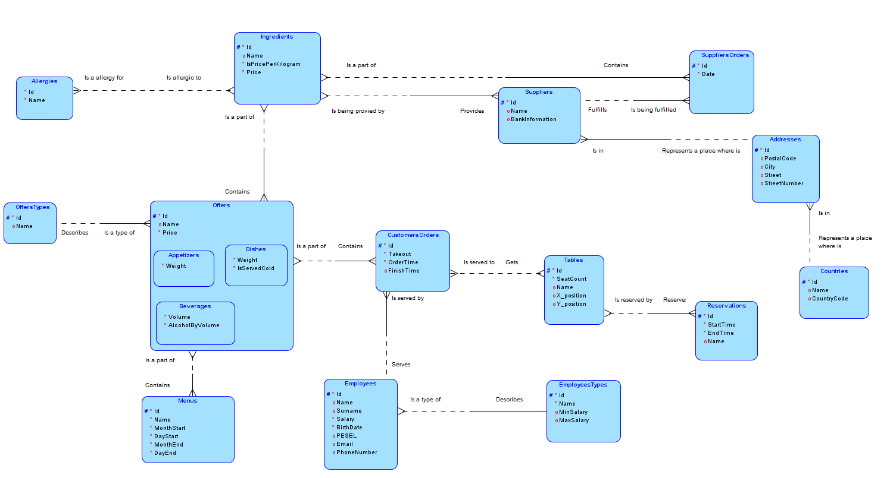
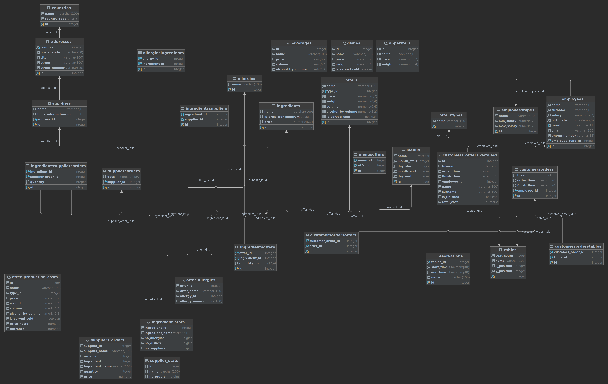

# BD2_Z12

## Zakres projektu

Naszym projektem jest baza danych do obsługi restauracji i wspomagania jej działania. Baza danych będzie zawierała:

* Informacje o stolikach, historię rezerwacji tychże stolików, aktualne rezerwacje stolików  i aktualnym wykazie ich zajętości.
* Dane o dostępnym dla klientów menu, dane o każdej pozycji z menu, oraz możliwości serwowania tego (m. in. baza danych będzie zawierała informacje o daniach sezonowych, dostępnych przez ograniczony czas).
* Historię zamówień, jakie zostały realizowane w restauracji.
Baza danych będzie wspierała nie tylko proces obsługi klientów, ale tez procesy wewnętrze, które zachodzą w restauracji:
* Baza danych będzie zawierała informacje o składnikach potrzebnych do każdego dania, a także będzie miała informacje o zaopatrzeniu potrzebnego do przygotowania posiłku dla klienta.
* Restauracja będzie tez gromadziła informacje o dostawcach i dostawach każdego składnika potrzebnego do przygotowywania dań.
* Baza danych będzie zbierała informacje o pracownikach restauracji – przy czym będzie ona potrafiła rozróżnić różne typy pracownika, jakie mogą się znajdować w restauracji.

W ramach tego projektu, zostanie także stworzona prosta aplikacja webowa, której zadaniem będzie wizualizacja aktualnej zajętości poszczególnych stolików. Aplikacja, oczywiście, będzie pobierać dane z dostarczonej w tym projekcie bazy danych.

## Wstępny model koncepcyjny projektu

## Model relacyjny projektu

## Model fizyczny bazy danych

## Podział zadań

Każdy z członków zespołu będzie zajmował się tworzeniem modelu i architektury bazy danych. Jednak każdy z członków będzie miał przypisane także dodatkowe zadania, potrzebne to realizacji projektu:
* @jfidor i @mlojek - back-end aplikacji
* @bhan – implementacja bazy danych
* @imatynia - front-end/back-end aplikacji

## Technologie
* Postgresql -> baza danych
* Django -> do back-endu i front-endu aplikacji
  * Bootstrap5 - biblioteka dedykowana responsywnemu UI
  * Plotly - biblioteka do tworzenia interaktywnych wykresów
  * Jinja - renderowanie wzorców

