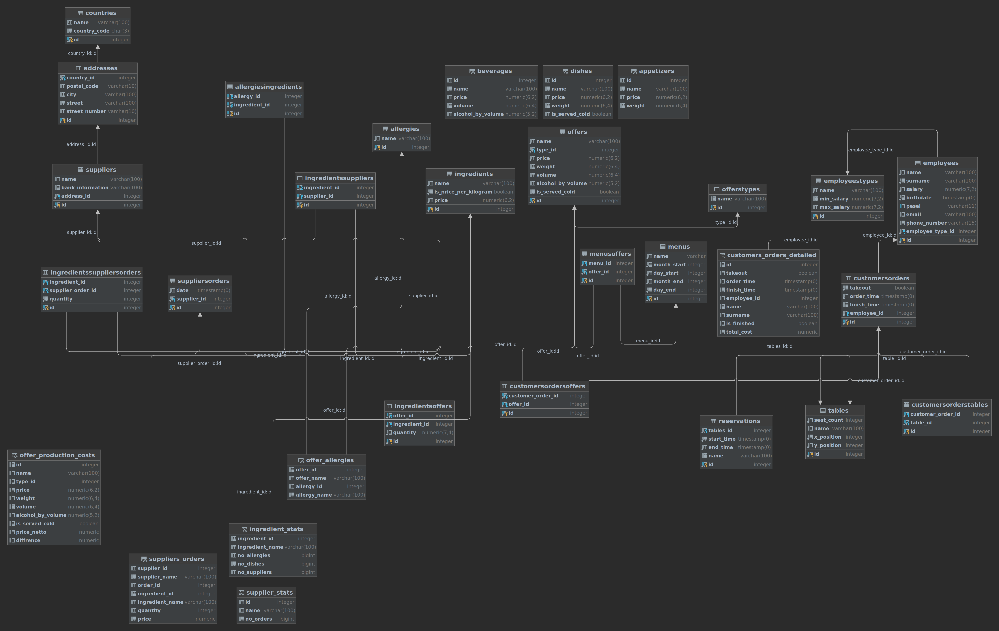

# Database Documentation
The following document describes the data tables, views, functions and triggers implemented in the database in our project.
# Physical model

# Tables
## Table: countries
This table stores information about countries.
| Column        | Type          | Description                             |
| ------------- | ------------- | --------------------------------------- |
| id            | serial        | Unique identifier for the country       |
| name          | varchar(100)  | Name of the country                     |
| country_code  | char(3)       | Country code                            |

## Table: addresses
This table stores information about addresses.
| Column         | Type          | Description                             |
| -------------- | ------------- | --------------------------------------- |
| id             | serial        | Unique identifier for the address       |
| country_id     | int           | Foreign key referencing countries table |
| postal_code    | varchar(10)   | Postal code                             |
| city           | varchar(100)  | City name                               |
| street         | varchar(100)  | Street name                             |
| street_number  | varchar(10)   | Street number                           |

## Table: allergies
This table stores information about allergies.
| Column        | Type          | Description                             |
| ------------- | ------------- | --------------------------------------- |
| id            | serial        | Unique identifier for the allergy       |
| name          | varchar(100)  | Name of the allergy                     |

## Table: customersOrders
This table stores information about customer orders.
| Column        | Type          | Description                              |
| ------------- | ------------- | ---------------------------------------- |
| id            | serial        | Unique identifier for the customer order |
| takeout       | boolean       | Indicates if the order is for takeout    |
| order_time    | timestamp(0)  | Timestamp of the order                   |
| finish_time   | timestamp(0)  | Timestamp of when the order was finished |
| employee_id   | int           | Foreign key referencing employees table  |

## Table: offers
This table stores information about offers.
| Column              | Type          | Description                                              |
| ------------------- | ------------- | -------------------------------------------------------- |
| id                  | serial        | Unique identifier for the offer                          |
| name                | varchar(100)  | Name of the offer                                        |
| type_id             | int           | Foreign key referencing offersTypes table                |
| price               | int(6,2)  | Price of the offer                                       |
| weight              | int(6,4)  | Weight of the offer (appetizers and dishes)              |
| volume              | int(6,4)  | Volume of the offer (beverages)                          |
| alcohol_by_volume   | int(5,2)  | Alcohol by volume of the offer (beverages)               |
| is_served_cold      | boolean       | Indicates if the offer is served cold (dishes)           |

## Table: offersTypes
This table stores information about offer types.
| Column        | Type          | Description                             |
| ------------- | ------------- | --------------------------------------- |
| id            | serial        | Unique identifier for the offer type    |
| name          | varchar(100)  | Name of the offer type                  |

## Table: menusOffers
This table stores information about the relationship between menus and offers.
| Column        | Type          | Description                             |
| ------------- | ------------- | --------------------------------------- |
| id            | serial        | Unique identifier for the menu offer    |
| menu_id       | int           | Foreign key referencing menus table     |
| offer_id      | int           | Foreign key referencing offers table    |

## Table: ingredients
This table stores information about ingredients.
| Column                | Type          | Description                              |
| --------------------- | ------------- | ---------------------------------------- |
| id                    | serial        | Unique identifier for the ingredient     |
| name                  | varchar(100)  | Name of the ingredient                   |
| is_price_per_kilogram | boolean       | Indicates if the price is per kilogram   |
| price                 | int(6,2)      | Price of the ingredient                  |

## Table: employees
This table stores information about employees.
| Column          | Type          | Description                                  |
| --------------- | ------------- | -------------------------------------------- |
| id              | serial        | Unique identifier for the employee           |
| name            | varchar(100)  | Employee's first name                        |
| surname         | varchar(100)  | Employee's last name                         |
| salary          | int(7,2)      | Salary of the employee                       |
| birthdate       | timestamp(0)  | Employee's birthdate                         |
| pesel           | varchar(11)   | Employee's PESEL number                      |
| email           | varchar(100)  | Employee's email address                     |
| phone_number    | varchar(15)   | Employee's phone number                      |
| employee_type_id| int           | Foreign key referencing employeesTypes table |

## Table: employeesTypes
This table stores information about employee types.
| Column        | Type          | Description                              |
| ------------- | ------------- | ---------------------------------------- |
| id            | serial        | Unique identifier for the employee type  |
| name          | varchar(100)  | Name of the employee type                |
| min_salary    | int(7,2)      | Minimum salary for the employee type     |
| max_salary    | int(7,2)      | Maximum salary for the employee type     |

## Table: reservations
This table stores information about reservations.
| Column        | Type          | Description                              |
| ------------- | ------------- | ---------------------------------------- |
| id            | serial        | Unique identifier for the reservation    |
| tables_id     | int           | Foreign key referencing tables table     |
| start_time    | timestamp(0)  | Start time of the reservation            |
| end_time      | timestamp(0)  | End time of the reservation              |
| name          | varchar(100)  | Name for the reservation                 |

## Table: menus
This table stores information about menus.
| Column        | Type          | Description                             |
| ------------- | ------------- | --------------------------------------- |
| id            | serial        | Unique identifier for the menu          |
| name          | varchar       | Name of the menu                        |
| month_start   | int           | Starting month of the menu              |
| day_start     | int           | Starting day of the menu                |
| month_end     | int           | Ending month of the menu                |
| day_end       | int           | Ending day of the menu                  |

## Table: suppliersOrders
This table stores information about supplier orders.
| Column        | Type          | Description                              |
| ------------- | ------------- | ---------------------------------------- |
| id            | serial        | Unique identifier for the supplier order |
| date          | timestamp(0)  | Date of the supplier order               |
| supplier_id   | int           | Foreign key referencing suppliers table  |

## Table: tables
This table stores information about tables.
| Column        | Type          | Description                             |
| ------------- | ------------- | --------------------------------------- |
| id            | serial        | Unique identifier for the table         |
| seat_count    | int           | Number of seats at the table            |
| name          | varchar(100)  | Name of the table                       |
| x_position    | int           | X position of the table                 |
| y_position    | int           | Y position of the table                 |

## Table: suppliers
This table stores information about suppliers.
| Column             | Type          | Description                              |
| ------------------ | ------------- | ---------------------------------------- |
| id                 | serial        | Unique identifier for the supplier       |
| name               | varchar(100)  | Supplier's name                          |
| bank_information   | varchar(100)  | Supplier's bank information              |
| address_id         | int           | Foreign key referencing addresses table  |

## Table: allergiesIngredients
This table represents the relationship between allergies and ingredients.
| Column          | Type          | Description                              |
| --------------- | ------------- | ---------------------------------------- |
| id              | serial        | Unique identifier for the relationship   |
| allergy_id      | int           | Foreign key referencing allergies table  |
| ingredient_id   | int           | Foreign key referencing ingredients table|

## Table: ingredientsSuppliers
This table represents the relationship between ingredients and suppliers.
| Column          | Type          | Description                              |
| --------------- | ------------- | ---------------------------------------- |
| id              | serial        | Unique identifier for the relationship   |
| ingredient_id   | int           | Foreign key referencing ingredients table|
| supplier_id     | int           | Foreign key referencing suppliers table  |

## Table: ingredientsSuppliersOrders
This table represents the relationship between ingredients, supplier orders, and quantity.
| Column             | Type          | Description                                   |
| ------------------ | ------------- | --------------------------------------------- |
| id                 | serial        | Unique identifier for the relationship        |
| ingredient_id      | int           | Foreign key referencing ingredients table     |
| supplier_order_id  | int           | Foreign key referencing suppliersOrders table |
| quantity           | int           | Quantity of the ingredient in the order       |

## Table: ingredientsOffers
This table represents the relationship between ingredients and offers.
| Column          | Type          | Description                               |
| --------------- | ------------- | ----------------------------------------- |
| id              | serial        | Unique identifier for the relationship    |
| offer_id        | int           | Foreign key referencing offers table      |
| ingredient_id   | int           | Foreign key referencing ingredients table |
| quantity        | int(7,4)      | Quantity of the ingredient in the offer   |

## Table: customersOrdersOffers
This table represents the relationship between customer orders and offers.
| Column             | Type          | Description                                   |
| ------------------ | ------------- | --------------------------------------------- |
| id                 | serial        | Unique identifier for the relationship        |
| customer_order_id  | int           | Foreign key referencing customersOrders table |
| offer_id           | int           | Foreign key referencing offers table          |

## Table: customersOrdersTables
This table represents the relationship between customer orders and tables.
| Column              | Type          | Description                                   |
| ------------------- | ------------- | --------------------------------------------- |
| id                  | serial        | Unique identifier for the relationship        |
| customer_order_id   | int           | Foreign key referencing customersOrders table |
| table_id            | int           | Foreign key referencing tables table          |

# Views
## Materialized View: offer_production_costs
This view describes the cost of all products that go into producing a dish.
| Column        | Type          | Description                                       |
| ------------- | ------------- | ------------------------------------------------- |
| id            | serial        | Unique identifier for the offer                   |
| name          | varchar(100)  | Name of the offer                                 |
| price         | int           | Price of the offer                                |
| price_netto   | int           | Net price of the offer after ingredient costs     |
| difference    | int           | Difference between the offer price and net price  |

## Materialized View: offer_allergies
This view pairs dishes with allergens they include.
| Column        | Type          | Description                                    |
| ------------- | ------------- | ---------------------------------------------- |
| offer_id      | serial        | ID of the offer                                |
| offer_name    | varchar(100)  | Name of the offer                              |
| allergy_id    | serial        | ID of the allergy associated with the offer    |
| allergy_name  | varchar(100)  | Name of the allergy associated with the offer  |

## Materialized View: suppliers_orders
This view describes in detail all orders made by the restaurant.
| Column           | Type           | Description                                         |
| ---------------- | -------------- | --------------------------------------------------- |
| supplier_id      | serial         | ID of the supplier                                  |
| supplier_name    | varchar(100)   | Name of the supplier                                |
| order_id         | serial         | ID of the order                                     |
| ingredient_id    | serial         | ID of the ingredient                                |
| ingredient_name  | varchar(100)   | Name of the ingredient                              |
| quantity         | int            | Quantity of the ingredient in the supplier order    |
| price            | int            | Total price of the ingredient in the supplier order |

## Materialized View: ingredient_stats
This view descibes some statistics of ingredients.
| Column           | Type    | Description                                        |
| ---------------- | ------- | -------------------------------------------------- |
| ingredient_id    | serial  | ID of the ingredient                               |
| ingredient_name  | text    | Name of the ingredient                             |
| no_allergies     | int     | Number of allergies associated with the ingredient |
| no_dishes        | int     | Number of dishes that include the ingredient       |
| no_suppliers     | int     | Number of suppliers that provide the ingredient    |

## Materialized View: supplier_stats
This views counts number of orders for every supplier.
| Column        | Type    | Description                                    |
| ------------- | ------- | ---------------------------------------------- |
| id            | int     | ID of the supplier                             |
| name          | text    | Name of the supplier                           |
| no_orders     | int     | Number of orders associated with the supplier  |

## View: customers_orders_detailed
This view describes in detail the orders of customers.
| Column            | Type          | Description                                         |
| ----------------- | ------------- | --------------------------------------------------- |
| id                | serial        | ID of the customer order                            |
| customer_order_id | serial        | Foreign key referencing the `customersorders` table |
| table_id          | serial        | Foreign key referencing the `tables` table          |
| name              | varchar(100)  | Name of the employee who processed the order        |
| surname           | varchar(100)  | Surname of the employee who processed the order     |
| is_finished       | boolean       | Indicates whether the order is finished             |
| total_cost        | int           | Total cost of the customer order                    |

## Materialized View: appetizers
This view is a subset of `offers` table that only contains appetizers.
| Column   | Type         | Description                           |
| -------- | ------------ | ------------------------------------- |
| id       | serial       | ID of the offer                       |
| name     | varchar(100) | Name of the offer                     |
| price    | int          | Price of the offer                    |
| weight   | int          | Weight of the offer                   |

## Materialized View: beverages
This view is a subset of `offers` table that only contains beverages.
| Column              | Type         | Description                                |
| ------------------- | ------------ | ------------------------------------------ |
| id                  | serial       | ID of the offer                            |
| name                | varchar(100) | Name of the offer                          |
| price               | int          | Price of the offer                         |
| volume              | int          | Volume of the beverage                     |
| alcohol_by_volume   | int          | Alcohol content of the beverage (if any)   |

## Materialized View: dishes
This view is a subset of `offers table that only contains dishes
| Column         | Type         | Description                               |
| -------------- | ------------ | ----------------------------------------- |
| id             | serial       | ID of the offer                           |
| name           | varchar(100) | Name of the offer                         |
| price          | int          | Price of the offer                        |
| weight         | int          | Weight of the dish                        |
| is_served_cold | boolean      | Indicates whether the dish is served cold |

# Functions
## Function: count_cost_of_ingredients_of_offer
- Parameters:
  - `d_id` (integer): ID of the offer
- Returns: `NUMERIC(8,4)`
- Description: Calculates the total cost of ingredients for a given offer. It multiplies the quantity of each ingredient associated with the offer by its price and returns the sum.

## Function: count_cost_of_ingredients_of_order
- Parameters:
  - `supp_order_id` (integer): ID of the supplier order
- Returns: `NUMERIC(8,4)`
- Description: Calculates the total cost of ingredients for a given supplier order. It multiplies the quantity of each ingredient in the order by its price and returns the sum.

## Function: count_cost_of_customer_order
- Parameters:
  - `cus_order_id` (integer): ID of the customer order
- Returns: `NUMERIC(8,4)`
- Description: Calculates the total cost of an entire customer order. It retrieves the price of each offer associated with the order and returns the sum of all offer prices.

## Function: get_menu_id_of_date
- Parameters:
  - `month` (integer): Month value
  - `day` (integer): Day value
- Returns: `INT`
- Description: Retrieves the ID of the menu that corresponds to a specific date. It compares the provided month and day values with the start and end dates of each menu and returns the ID of the menu that matches.

## Function: get_menu_id_of_now
- Parameters: None
- Returns: `INT`
- Description: Retrieves the ID of the menu that corresponds to the current date. It extracts the month and day from the current timestamp, compares them with the start and end dates of each menu, and returns the ID of the menu that matches.

# Triggers
1. Function: `check_employee_salary()`

   Description: This function checks if the salary of an employee falls within the minimum and maximum salary range specified for their employee type. It is triggered before inserting or updating records in the `employees` table.

   Parameters: None

   Returns: Trigger function (returns `NEW`)

2. Trigger: `check_salary`

   Description: This trigger calls the `check_employee_salary()` function before inserting or updating records in the `employees` table.

   Trigger Event: Before INSERT or UPDATE on `employees` table

   Trigger Function: `check_employee_salary()`

3. Function: `check_ingredients_suppliers_integrity()`

   Description: This function checks if a supplier has a corresponding ingredient in the `ingredientsSuppliers` table based on the `supplier_order_id` and `ingredient_id` provided. It is triggered before inserting or updating records in the `ingredientsSuppliersOrders` table.

   Parameters: None

   Returns: Trigger function (returns `NEW`)

4. Trigger: `check_ingredients_orders`

   Description: This trigger calls the `check_ingredients_suppliers_integrity()` function before inserting or updating records in the `ingredientsSuppliersOrders` table.

   Trigger Event: Before INSERT or UPDATE on `ingredientsSuppliersOrders` table

   Trigger Function: `check_ingredients_suppliers_integrity()`

5. Function: `validate_pesel()`

   Description: This function validates the PESEL (Polish national identification number) for employees. It checks if the provided PESEL is a valid 11-digit number and has the correct control sum. It is triggered before inserting or updating records in the `employees` table.

   Parameters: None

   Returns: Trigger function (returns `NEW`)

6. Trigger: `validate_pesel`

   Description: This trigger calls the `validate_pesel()` function before inserting or updating records in the `employees` table.

   Trigger Event: Before INSERT or UPDATE on `employees` table

   Trigger Function: `validate_pesel()`

7. Function: `check_valid_date(date_month INT, date_day INT)`

   Description: This function checks if a date is valid by verifying the month and day values. It raises an exception if the month or day is negative or if the date exceeds the maximum possible values for the given month. It is a helper function used by other triggers.

   Parameters:
   - `date_month`: Integer representing the month value
   - `date_day`: Integer representing the day value

   Returns: Boolean (`TRUE` if the date is valid)

8. Function: `check_menu_dates()`

   Description: This function checks the validity of the start and end dates for a menu by calling the `check_valid_date()` function. It is triggered before inserting or updating records in the `menus` table.

   Parameters: None

   Returns: Trigger function (returns `NEW`)

9. Trigger: `check_date_validity`

   Description: This trigger calls the `check_menu_dates()` function before inserting or updating records in the `menus` table.

   Trigger Event: Before INSERT or UPDATE on `menus` table

   Trigger Function: `check_menu_dates()`

10. Function: `check_date_overlaps()`

    Description: This function checks if a new menu overlaps with any existing menus based on the start and end dates. It raises an exception if an overlap is found. It is triggered before inserting or updating records in the `menus` table.

    Parameters: None

    Returns: Trigger function (returns `NEW`)

11. Trigger: `check_menus_overlaps`

    Description: This trigger calls the `check_date_overlaps()` function before inserting or updating records in the `menus` table.

    Trigger Event: Before INSERT or UPDATE on `menus` table

    Trigger Function: `check_date_overlaps()`

12. Function: `check_type_of_offer()`

    Description: This function checks the attributes of an offer based on its `type_id`. It ensures that the attributes match the requirements defined for each offer type. It is triggered before inserting or updating records in the `offers` table.

    Parameters: None

    Returns: Trigger function (returns `NEW`)

13. Trigger: `check_offer_type`

    Description: This trigger calls the `check_type_of_offer()` function before inserting or updating records in the `offers` table.

    Trigger Event: Before INSERT or UPDATE on `offers` table

    Trigger Function: `check_type_of_offer()`

14. Function: `check_if_customer_order_is_for_table()`

    Description: This function checks if a customer order is associated with a table and not a takeout order. It raises an exception if the customer order is marked as a takeout order. It is triggered before inserting or updating records in the `customersOrdersTables` table.

    Parameters: None

    Returns: Trigger function (returns `NEW`)

15. Trigger: `check_customer_order_table_validity`

    Description: This trigger calls the `check_if_customer_order_is_for_table()` function before inserting or updating records in the `customersOrdersTables` table.

    Trigger Event: Before INSERT or UPDATE on `customersOrdersTables` table

    Trigger Function: `check_if_customer_order_is_for_table()`

16. Function: `check_costs_of_offer()`

    Description: This function checks if the costs of ingredients for an offer exceed its price. It compares the total cost of ingredients to the price of the offer. If the costs exceed the price, a warning is raised. It is triggered after inserting or updating records in the `ingredientsOffers` table.

    Parameters: None

    Returns: Trigger function (returns `NEW`)

17. Trigger: `check_offers_costs`

    Description: This trigger calls the `check_costs_of_offer()` function after inserting or updating records in the `ingredientsOffers` table.

    Trigger Event: After INSERT or UPDATE on `ingredientsOffers` table

    Trigger Function: `check_costs_of_offer()`

18. Function: `check_reservations_overlaps()`

    Description: This function checks if a new reservation overlaps with any existing reservations for the same table. It raises an exception if an overlap is found. It is triggered before inserting or updating records in the `reservations` table.

    Parameters: None

    Returns: Trigger function (returns `NEW`)

19. Trigger: `check_reservations_validity`

    Description: This trigger calls the `check_reservations_overlaps()` function before inserting or updating records in the `reservations` table.

    Trigger Event: Before INSERT or UPDATE on `reservations` table

    Trigger Function: `check_reservations_overlaps()`
